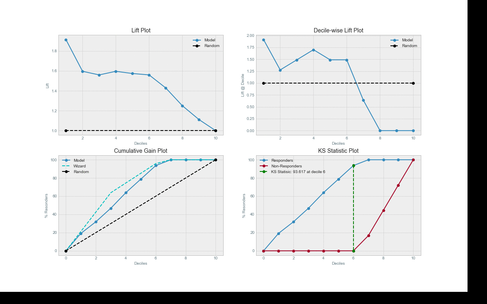
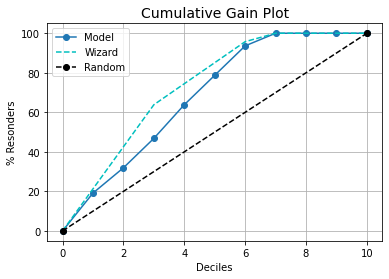
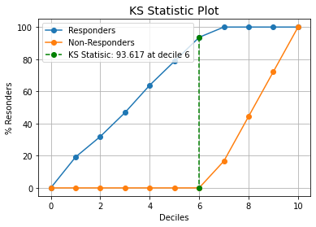
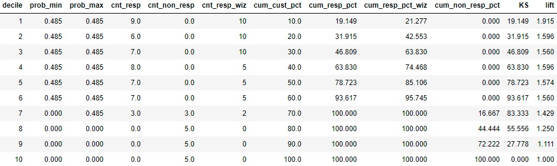
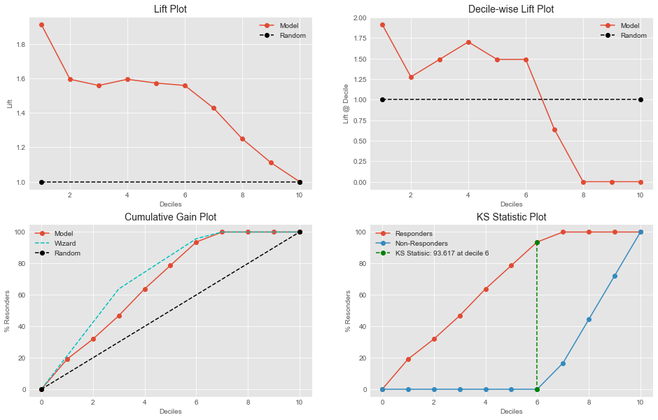

# kds - KeyToDataScience Visualization Library


### Plot Decile Table, Lift, Gain and KS Statistic charts with single line functions

### Just input _'labels'_ and _'probabilities'_ to get quick report for analysis

```python
kds.metrics.report(y_test, y_prob)
```
Report has an argument ``plot_style`` which has multiple plot style options. For more, explore examples !!



kds is the result of a data scientist's humble effort to provide an easy way of visualizing metrics. So that one can focus on the analysis rather than hassling with copy/paste of various visialization functions.

## Installation

Installation is simple! Just double check, you have the dependencies [Pandas](https://pypi.org/project/pandas/), [Numpy](https://pypi.org/project/numpy/)  and [Matplotlib](http://matplotlib.org/) installed.

Then just run:
```bash
pip install kds
```

Or if you want the latest development version, clone this repo and run
```bash
python setup.py install
```
at the root folder.

## Examples

Let's dive into using various plots with the sample iris dataset from scikit-learn.

### 1. Lift Plot

```python
# REPRODUCABLE EXAMPLE
# Load Dataset and train-test split
from sklearn.datasets import load_iris
from sklearn.model_selection import train_test_split
from sklearn import tree

X, y = load_iris(return_X_y=True)
X_train, X_test, y_train, y_test = train_test_split(X, y, test_size=0.33,random_state=3)
clf = tree.DecisionTreeClassifier(max_depth=1,random_state=3)
clf = clf.fit(X_train, y_train)
y_prob = clf.predict_proba(X_test)

# The magic happens here
import kds
kds.metrics.plot_lift(y_test, y_prob[:,1])
```


Yup... That's it. **single line functions for detailed visualization**.

You can see clearly here that `kds.metrics.lift` needs only the actual y_true values and the predicted probabilities to generate the plot. This lets you use *anything* you want as the classifier, from Random Forest to Keras NNs to XgBoost to any classifier algorithm you want to use.

Want to see more exapmles ??

### 2. Cumulative Gain Plot

```python
# REPRODUCABLE EXAMPLE
# Load Dataset and train-test split
from sklearn.datasets import load_iris
from sklearn.model_selection import train_test_split
from sklearn import tree

X, y = load_iris(return_X_y=True)
X_train, X_test, y_train, y_test = train_test_split(X, y, test_size=0.33,random_state=3)
clf = tree.DecisionTreeClassifier(max_depth=1,random_state=3)
clf = clf.fit(X_train, y_train)
y_prob = clf.predict_proba(X_test)

# The magic happens here
import kds
kds.metrics.plot_cumulative_gain(y_test, y_prob[:,1])
```


### 3. KS Statistic Plot

```python
# REPRODUCABLE EXAMPLE
# Load Dataset and train-test split
from sklearn.datasets import load_iris
from sklearn.model_selection import train_test_split
from sklearn import tree

X, y = load_iris(return_X_y=True)
X_train, X_test, y_train, y_test = train_test_split(X, y, test_size=0.33,random_state=3)
clf = tree.DecisionTreeClassifier(max_depth=1,random_state=3)
clf = clf.fit(X_train, y_train)
y_prob = clf.predict_proba(X_test)

# The magic happens here
import kds
kds.metrics.plot_ks_statistic(y_test, y_prob[:,1])
```


### 4. Decile Table

```python
# REPRODUCABLE EXAMPLE
# Load Dataset and train-test split
from sklearn.datasets import load_iris
from sklearn.model_selection import train_test_split
from sklearn import tree

X, y = load_iris(return_X_y=True)
X_train, X_test, y_train, y_test = train_test_split(X, y, test_size=0.33,random_state=3)
clf = tree.DecisionTreeClassifier(max_depth=1,random_state=3)
clf = clf.fit(X_train, y_train)
y_prob = clf.predict_proba(X_test)

# The magic happens here
import kds
kds.metrics.decile_table(y_test, y_prob[:,1])
```


### 5. Report

```python
# REPRODUCABLE EXAMPLE
# Load Dataset and train-test split
from sklearn.datasets import load_iris
from sklearn.model_selection import train_test_split
from sklearn import tree

X, y = load_iris(return_X_y=True)
X_train, X_test, y_train, y_test = train_test_split(X, y, test_size=0.33,random_state=3)
clf = tree.DecisionTreeClassifier(max_depth=1,random_state=3)
clf = clf.fit(X_train, y_train)
y_prob = clf.predict_proba(X_test)

# The magic happens here
import kds
kds.metrics.report(y_test, y_prob[:,1],plot_style='ggplot')
```
Choose among multiple ``plot_style`` list using ``plt.style.available``, to generate quick and beautiful plots.




## Contributing to kds

Contributions are what make the open source community such an amazing place to be learn, inspire, and create. Any contributions you make are **greatly appreciated**.

Please read CONTRIBUTING.md for details on our code of conduct, and the process for submitting pull requests to us.
Visit our [contributor guidelines](CONTRIBUTING.md).

Happy plotting!